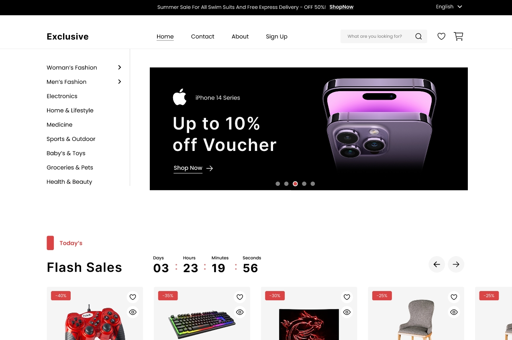

✨ E-Commerce Website UI/UX Design

This project is a modern e-commerce prototype, created to showcase skills in interface design and user experience.

🎯 Objective

To create a clean, intuitive, and responsive shopping experience that emphasizes both aesthetics and usability.

🖼️ Preview

👉 View the full design on Figma:
Project on Figma: [Project on Figma](https://www.figma.com/design/M138bS1ZqlYpXiLzssUFL2/Full-E-Commerce-Website-UI-UX-Design--Community-?node-id=1-3&p=f&t=hLxUV3ctwe8UMeY6-0)

🚀 Live Preview:  
https://mauricioibzde.github.io/LANDING-PAGE-ONLINEGESCH-FT/

💡 Highlights

Minimalistic and modern layout

Consistent color palette

Reusable components

Focus on accessibility and smooth navigation

📂 Structure

Home – Presentation and highlights

Catalog – Products organized by category

Product Page – Details, images, and reviews

Cart – Summary and checkout

User Area – Login, registration, and order history

👨‍💻 Author

Developed by Mauricio Farias as part of his studies in UI/UX and front-end development.

---

## 📊 Project Analysis

Comprehensive project analysis and recommendations available:

- **[Executive Summary](./ANALYSIS-SUMMARY.md)** - Quick overview with actionable recommendations
- **[Detailed Analysis](./PROJECT-ANALYSIS.md)** - Full technical analysis (500+ lines)
- **[Style Guide](./GUIA-SEMANTICA.md)** - BEM methodology and best practices

**Overall Quality Score:** 8.5/10

### Key Strengths:
✅ Excellent CSS architecture (BEM methodology)  
✅ Strong semantic HTML and accessibility  
✅ Comprehensive documentation  
✅ Responsive design with mobile-first approach

### Priority Improvements:
- Image optimization (70% size reduction possible)
- JavaScript functionality implementation
- SEO meta tags enhancement
- HTML validation fixes